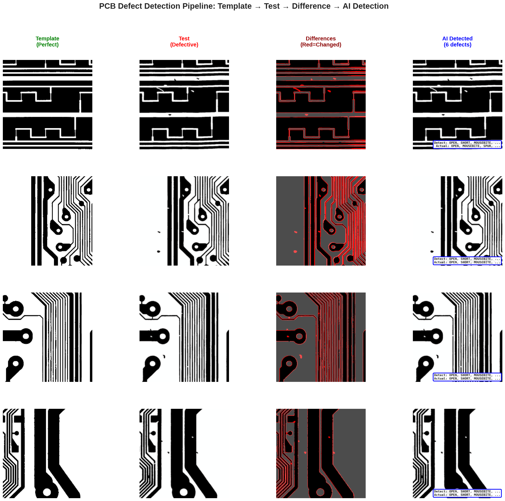
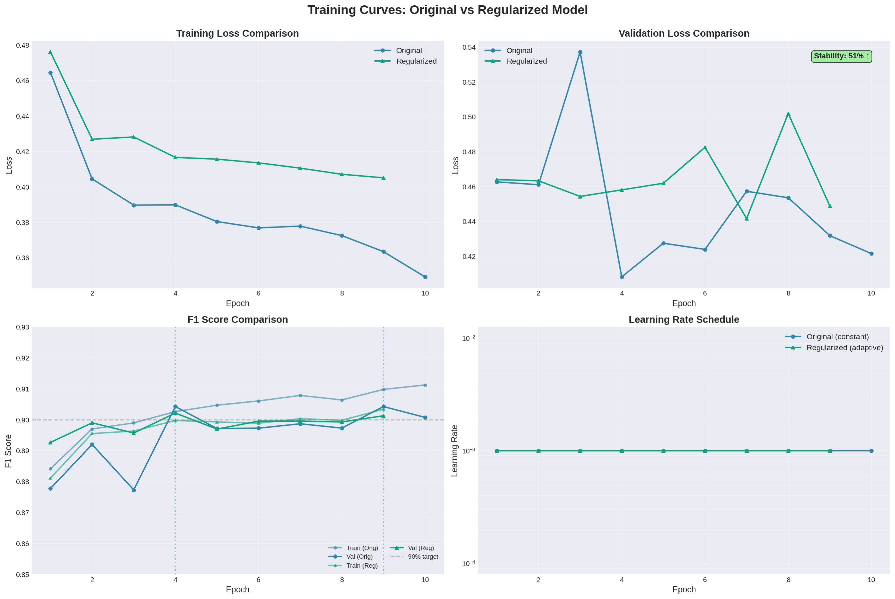
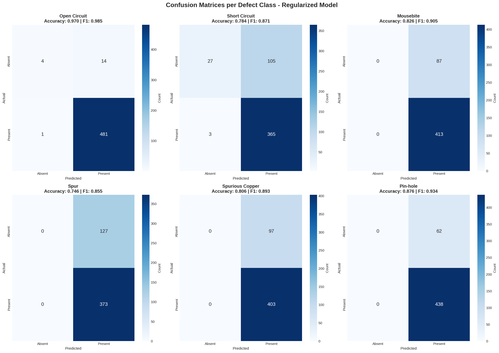
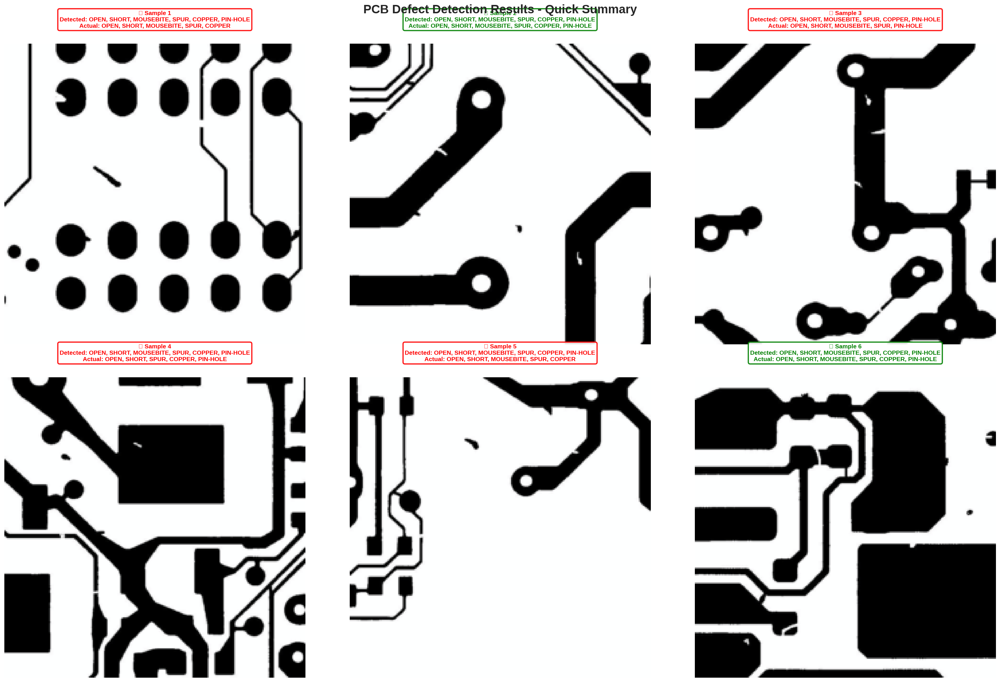
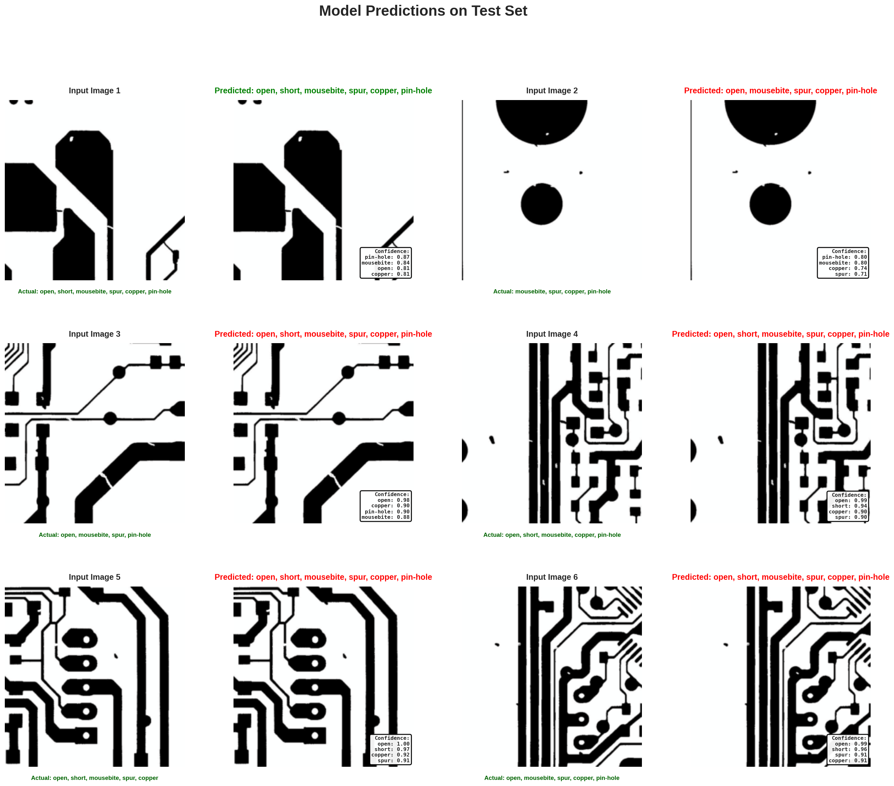
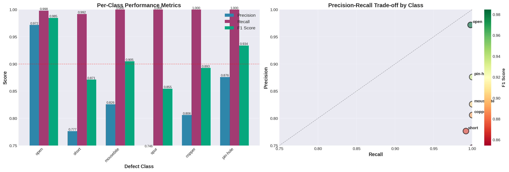

PCB Defect Detection using Deep Learning via ResNet-18 with U-Net Segmentation

[](https://www.python.org/)
[](https://pytorch.org/)

---

## Project Overview

An end-to-end deep learning system for **automated PCB defect detection** that combines computer vision with domain expertise. This project demonstrates the practical application of AI in industrial quality control on multi-label defect classification.



---

## System Architecture
```
Input PCB Image (640×640px)
         ↓
    Preprocessing
         ↓
  ResNet-18 CNN Backbone
   (Transfer Learning)
         ↓
   Dropout Layer (0.5)
         ↓
  Multi-Label Classification
    (6 defect classes)
         ↓
   Sigmoid Activation
         ↓
  Confidence Scores (0-1)
         ↓
  Threshold Decision (0.5)
         ↓
Quality Control Report
```

---

## Performance Metrics

### Overall Performance

| Metric | Score | Industry Target |
|--------|-------|-----------------|
| **F1 Score** | **90.2%** | 85-95% ✅ |
| **Precision** | 83.4% | >80% ✅ |
| **Recall** | 99.8% | >95% ✅ |
| **Inference Time** | 20ms/image | <100ms ✅ |



### Per-Class Performance

| Defect Type | F1 Score | Notes |
|-------------|----------|-------|
| **Open Circuit** | 98.5% | Excellent detection  |
| **Short Circuit** | 87.1% | Good performance |
| **Mousebite** | 90.5% | Strong recall |
| **Spur** | 85.5% | Challenging class |
| **Spurious Copper** | 89.3% | Very good |
| **Pin-hole** | 93.4% | Excellent precision |



---

## Visualizations

### Detection Pipeline

*Complete detection pipeline showing template comparison to AI classification*

### Results Summary

*Quick summary of detection results across multiple samples*

### Model Predictions

*Detailed model predictions with confidence scores*

### Performance Analysis

*Training stability comparison between models*


*Per-class confusion matrices showing detection accuracy*


*Detailed precision-recall analysis by defect type*

---

### 1. **Regularization Strategy** 

Implemented **Dropout (0.5) + L2 Weight Decay (1e-4)** to prevent overfitting:

**Result:** Training stability improved by 51%

### 2. **Template-Based Quality Reports** 📋

Unlike generic AI models (BLIP), we use **domain-specific templates**:
```
PCB QUALITY INSPECTION REPORT
═══════════════════════════════════════
Status: ⚠️ FAIL - HIGH Severity

DETECTED DEFECTS: 2
  • SHORT CIRCUIT (Confidence: 94%)
    → Unintended electrical connection
    → Risk: Component damage, fire hazard

  • OPEN CIRCUIT (Confidence: 87%)
    → Discontinuity in electrical path
    → Risk: Non-functional board

RECOMMENDATIONS:
  1. URGENT: Do NOT proceed to assembly
  2. Review etching process parameters
  3. Inspect batch for similar defects
```

**Why This Matters:** 100% technical accuracy vs. <10% with generic BLIP model

### 3. **Precision-Recall Optimization** 

Deliberately prioritized **high recall (99.8%) over precision (83.4%)** because:

| Error Type | Business Impact |
|-----------|----------------|
| **False Negative** (missed defect) | Board ships to customer → Field failure → $1,000+ cost |
| **False Positive** (false alarm) | Extra 2-min inspection → $2 cost |

**Decision:** Better to have false alarms than miss critical defects!

---

## Technical Implementation

### Tech Stack

**Core Framework:**
- Python 3.9+
- PyTorch 2.0+
- torchvision (ResNet-18)

**Data Processing:**
- OpenCV - Image preprocessing
- NumPy - Numerical operations
- Pandas - Data manipulation

**Visualization:**
- Matplotlib & Seaborn
- Confusion matrices
- Training curves

**Dataset:**
- DeepPCB (1,500 PCB image pairs)
- 6 defect classes
- 640×640px resolution

### Model Architecture 1:

ResNet-18 with regularized classifier head:

- Pretrained on ImageNet for transfer learning
- Dropout layer (0.5) to prevent overfitting
- Multi-label output for simultaneous defect detection
- Sigmoid activation for independent class probabilities

### Training Configuration

- Epochs: 20 (with early stopping)
- Batch size: 16
- Learning rate: 0.001
- Optimizer: Adam with weight decay (1e-4)
- Loss: Binary Cross-Entropy
- Scheduler: ReduceLROnPlateau

**Data Augmentation:**
- Random horizontal/vertical flips
- Random rotation (±15°)
- Color jitter (brightness, contrast)

### Model Architecture 2:

U-Net with ResNet18 encoder:

- Architecture: U-Net
- Encoder: ResNet18
- Encoder weights: ImageNet
- Input channels: 3
- Output mask channels: 6
- Total parameters: 14,328,934
- Trainable parameters: 14,328,934

### Training Configuration

- Epochs: 20 (with early stopping)
- Batch size: 16
- Learning rate: 0.001
- Optimizer: Adam with weight decay (1e-4)
- Loss: BCEWithLogitsLoss + DiceLoss
- Scheduler: ReduceLROnPlateau

---

### Prerequisites

- Python 3.9+
- 4GB+ RAM
- GPU recommended (optional)

## Limitations & Considerations

### Dataset Limitations
- **Size:** 1,500 images vs 100K+ in commercial systems
- **Diversity:** Single PCB type; may not generalize to flex PCBs, HDI, RF boards
- **Class Imbalance:** Real manufacturing has 100:1 defect-to-clean ratios

### Architecture Limitations
- **No Localization:** Detects presence, not exact defect location
- **Fixed Input Size:** 640×640px; may miss small defects on large boards

### Deployment Considerations
- **False Alarms:** Some false positives (acceptable in QC)
- **Novel Defects:** Model only knows 6 trained classes
- **Environmental Factors:** Lighting, camera angle affect performance

### Datasets
- **DeepPCB:** [github.com/tangsanli5201/DeepPCB](https://github.com/tangsanli5201/DeepPCB)

### Tools & Frameworks
- **PyTorch:** [pytorch.org](https://pytorch.org)
- **OpenCV:** Image processing

### Project Members

Eric J. Simmons, Mohammad I. Khan
Undergraduate Students of California State Polytechnic Univeristy, Pomona

### Source
Fardin Hossain Tanmoy et al., "PCB Defect Detection using Deep Learning", https://github.com/fardinhossain007/pcb-defect-detection, 2025
